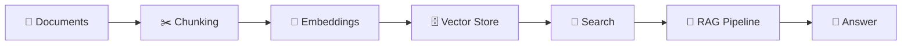

# 🔍 RAG Course

> A hands-on, step-by-step journey through building a Retrieval-Augmented Generation (RAG) pipeline from scratch — document loading, chunking, embeddings, vector search, and a working RAG system.


---

## 📌 What is this?

This repo is a modular, notebook-driven course that breaks a full RAG pipeline into digestible stages. Each folder is a self-contained lesson with runnable code, so you can learn each piece of the puzzle before wiring it all together into a complete pipeline.

## 🗺️ Course Map

| # | Module | What you'll learn |
|---|--------|--------------------|
| 1 | [`1_Document_Loaders`](./1_Document_Loaders) | Ingesting PDFs, text files, and other sources into a usable format |
| 2 | [`2_Chunking`](./2_Chunking) | Splitting documents into retrieval-friendly chunks (fixed-size, recursive, semantic) |
| 3 | [`3_Embeddings`](./3_Embeddings) | Turning text chunks into vector embeddings |
| 4 | [`4_Search`](./4_Search) | Similarity search fundamentals (cosine, dot product, hybrid search) |
| 5 | [`5_Vector_Store`](./5_Vector_Store) | Storing and querying embeddings with a vector database (Chroma) |
| 6 | [`6_Basic_RAG_Pipeline`](./6_Basic_RAG_Pipeline) | Putting it all together into an end-to-end RAG system |



## 🚀 Quickstart

**1. Clone the repo**
```bash
git clone https://github.com/<your-username>/RAG-Course.git
cd RAG-Course
```

**2. Set up the environment** (using [uv](https://github.com/astral-sh/uv))
```bash
uv sync
```
Or with pip:
```bash
python -m venv .venv
source .venv/bin/activate   # On Windows: .venv\Scripts\activate
pip install -r requirements.txt
```

**3. Configure your API keys**
```bash
cp .env.example .env
# then open .env and fill in your real keys
```

**4. Run a lesson**
```bash
jupyter notebook 1_Document_Loaders/
```

## 🔑 Environment Variables

Create a `.env` file (never commit this!) based on `.env.example`:

```env
OPENAI_API_KEY=
GROQ_API_KEY=
GOOGLE_API_KEY=
```

## 📂 Project Structure

```
RAG Course/
├── 1_Document_Loaders/
├── 2_Chunking/
├── 3_Embeddings/
├── 4_Search/
├── 5_Vector_Store/
├── 6_Basic_RAG_Pipeline/
├── src/
├── .env.example
├── .gitignore
├── pyproject.toml
├── requirements.txt
└── README.md
```

## 🛠️ Tech Stack

- **Language:** Python 3.11+
- **Vector Store:** ChromaDB
- **Embeddings/LLMs:** OpenAI, Groq, Google Generative AI
- **Notebooks:** Jupyter

## 🤝 Contributing

Contributions, issues, and suggestions are welcome! Feel free to:
- Open an issue for bugs or ideas
- Submit a PR with improvements
- ⭐ Star the repo if this helped you learn RAG!

## 📄 License

This project is licensed under the [MIT License](./LICENSE).

## 🙏 Acknowledgements

Built as a learning project to understand the internals of Retrieval-Augmented Generation, one module at a time.
